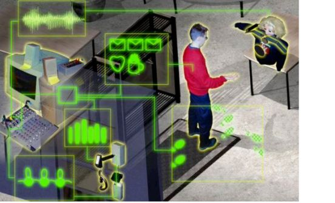

# Applicazioni pervasive

La tecnologia pervasiva è una tendenza emergente associata all'incorporazione
di microprocessori  
in oggetti di uso quotidiano, consentendo loro di comunicare informazioni.  
Le applicazioni pervasive mancano di display visivi di grandi dimensioni e
dispositivi di interazione  
familiari, come mouse e tastiere  
Incorporando i sistemi negli ambienti di tutti i giorni (i cosiddetti
"ambienti intelligenti") il focus  
delle applicazioni vocali si sposta da sistemi conversazionali a turni, di
iniziativa dell'utente, a una  
direzione più proattiva e distribuita.  
Un esempio di applicazione pervasiva è la Doorman:  

