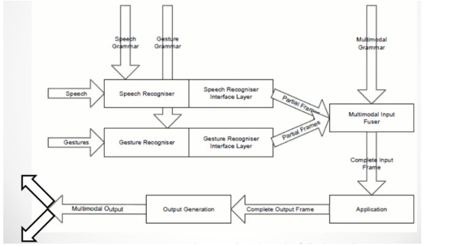

# Cooperation policies / types (esame)

Un sistema multimodale ha diverse modalità di input (visivo, uditivo, ecc.).
Ogni modalità ha caratteristiche che devono essere programmate dallo
sviluppatore. Per la cooperazione delle diverse modalità sono necessari **tre
componenti** :

  1. **Riconoscitore di modalità:** Capisce da quale modalità di input arriva il segnale dell'utente.
  

  2. **Modulo per la fusione dell'input multimodale:** Riceve l'input dal riconoscitore e fonde i risultati in un unico blocco completo per l'applicazione.
  

  3. **Modulo di feedback:** Accetta un blocco completo dall'applicazione e fornisce feedback agli utenti tramite l’uscita multimodale.
  
  
  

Le modalità possono cooperare in diversi modi:

  1. **Equivalenza:** se le stesse informazioni possono essere trattate in alternativa da una di esse.
  

  2. **Specializzazione:** se una determinata tipologia di informazione è sempre trattata dalla stessa modalità.
  

  3. **Ridondanza:** se le stesse informazioni sono trattate con queste modalità.
  

  4. **Complementarità:** se informazioni diverse vengono elaborate da ciascuna modalità ma devono essere unite.
  

  5. **Trasferimento:** se le informazioni prodotte da una modalità sono utilizzate da un'altra modalità.
  

  6. **Concorrenza:** se informazioni diverse vengono elaborate da più modalità contemporaneamente ma non devono essere unite.
  

