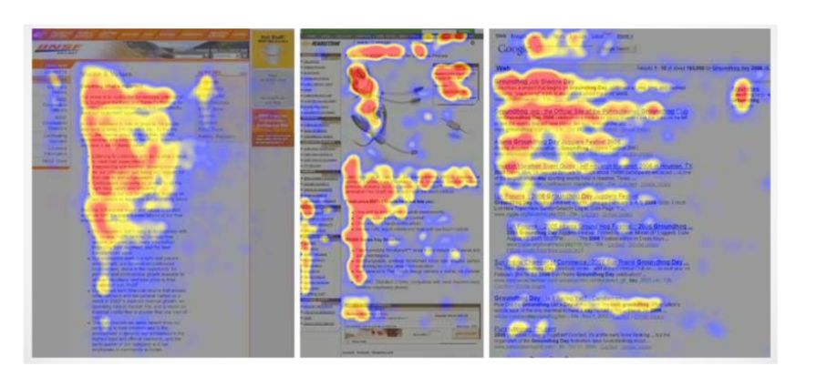

# Eyetracking, cos’è tecniche

Il metodo più diffuso per capire la posizione degli occhi sfrutta le immagini
di una telecamera.

  
Ci sono però altre tecniche che NON sfruttano il video ma altri tipi di
sensori come **nell’elettroculografia  **in cui vengono applicati degli
elettrodi sotto gli occhi con cui riusciamo a capire i movimenti orizzontali e
verticali degli occhi poiché quando muoviamo l’occhio si crea un piccola
tensione elettrica intorno ad esso.  
Poi abbiamo anche**  l’oculografia infrarossi**, ovvero se una sorgente di
luce fissa è diretta verso l'occhio, la quantità di luce riflessa verso un
rilevatore fisso varierà con la posizione dell'occhio. Il metodo più
utilizzato, però, come già detto, è quello basato sulle immagini che sfrutta
una telecamera combinata con software per calcolare la posizione della pupilla
e il suo centro. Questo  
permette di misurare movimenti oculari verticali ed orizzontali.  
  

Ci sono due modi per determinare la posizione degli occhi attraverso una
telecamera e sono il  
• **Bright Pupil**  
• **Dark Pupil**  
  

La loro differenza è basata sulla **posizione  **della luce rispetto
all’occhio, ovvero se la luce è sullo stesso asse dell’occhio allora esso è
illuminato dalla luce e la pupilla brilla (Bright Pupil) mentre se la luce è
spostata rispetto alla posizione dell’occhio la pupilla appare scura (Dark
Pupil).  
  

La tecnica Brigth Pupil è migliore della Dark Pupil perché riduce
l’interferenza delle ciglia e può essere usata in condizione di luce che vanno
dal buio al molto luminoso.  
  

Prima di iniziare con l’eye tracking ogni sistema prevede una fase di
**calibrazione**. Ogni uomo muove gli occhi in maniera diversa quindi la
calibrazione regolerà queste differenza, più è accurata la calibrazione
migliore è il sistema. Con l’eye tracking possiamo trovare:  
• **Heat Map** : ovvero le aree del video in cui gli utenti hanno guardato di
più e sono rappresentate da colori in ordine rosso (maggior intensità), giallo
(media intensità) e blu (bassa intensità).

• **Gaze Paths** : tiene traccia del percorso che occhi fanno quando ci si
muove da una parte all’altra dello schermo.

• **Areas of interest** : ovvero le parti dell’interfaccia in cui l’utente si
sofferma di più, si può  misurare la durata dell’attenzione su una determinata
area.

Secondo uno studio, gli utenti che leggono una determinata pagina, tendono ad
effettuare una F sullo schermo, questo è chiamato **F-shaped pattern.  
**  
Abbiamo due strisce orizzontali seguite da una striscia verticale. Gli utenti
leggono prima con un movimento orizzontale. Successivamente, gli utenti si
spostano leggermente verso il basso nella pagina e quindi leggono in un
secondo movimento orizzontale. Infine, scansionano il lato sinistro del
contenuto con un movimento verticale.  
  

Dei semplici consigli per catturare al meglio l’attenzione:

• Gli utenti non leggeranno il tuo testo completamente parola per parola. Una
lettura esauriente è rara, soprattutto quando i potenziali clienti stanno
conducendo le loro ricerche iniziali per compilare una rosa di fornitori.

• I primi due paragrafi devono riportare le informazioni più importanti.

C'è qualche speranza che gli utenti leggano effettivamente questo materiale,
anche se probabilmente leggeranno più del primo paragrafo che del secondo.  

