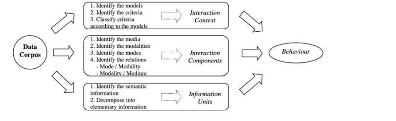

# Fission

La fissione significa come deve essere presentato l’output.

Una questione importante per l'interazione multimodale è come generare e
organizzare l‘output delle informazioni = fissione multimodale.

Bisogna sincronizzare le uscite se si usano diverse modalità Il processo di
fissione deve considerare quali informazioni devono essere presentata in base
all’input e di come queste informazioni possono essere presentate in termini
di struttura, di modalità e di scelte per l'uscita.

Per ciascun canale di comunicazione ci sono degli elementi che ci indicano la
struttura delle informazioni da mostrare. Ad esempio:

  * Per l’outupt **Vocale** : strutture sintattiche, l'ordine delle parole, l'intonazione e la prosodia
  

  * Per l’output **visivo** : la presentazione della **disposizione degli oggetti**.

  

Il primo modello concettuale per la presentazione multimodale di informazioni
e per la progettazione di sistemi di output multimodale è WWHT (What-Which-
How-Then) :

  

  

  * **What** : Quali sono le informazioni da presentare?
  * **Which** : Quali modalità dovremmo utilizzare per presentare queste informazioni?
  * **How** : Come presentare le informazioni utilizzando le modalità scelte?
  * **Then** : Quindi, come gestire l'evoluzione della presentazione?

Un sistema multimodale di output mira a presentare le informazioni in modo
“intelligente”  
sfruttando diverse modalità di comunicazione.  
  
Questo processo di presentazione intelligente delle informazioni si basa su
quattro elementi:  
  
• **information**  **to present** : queste informazioni sono generalmente
create dal core funzionale,  
inoltrate dal controller di dialogo e presentate dal modulo di uscita. Ad
esempio, il modulo di uscita di un telefono cellulare può presentare le
seguenti informazioni semantiche:  
“chiamata di X”, “messaggio di X”, “livello batteria basso”, ecc.  
  
• **interaction components** : un modo può essere associato a un insieme di
modalità ed ogni singola modalità può essere associata ad un insieme di mezzi.
Ad esempio: il mezzo “vibratore” permette l'espressione della modalità
“vibrazione” che si percepisce attraverso la modalità “tattile”. Si possono
distinguere due tipi di relazioni tra le componenti dell'interazione:
“primaria” e “secondaria”.  
  
Una relazione primaria si riferisce ad un effetto desiderato mentre una
relazione secondaria è un effetto collaterale. Esempio: la vibrazione del
cellulare viene utilizzata per essere percepita dall'utente in modo tattile.
Ciò implica una relazione primaria tra modalità “tattile” e modalità
“vibrazione”. Il suono generato dalle vibrazioni è un esempio di effetto
collaterale. Si può quindi aggiungere una relazione secondaria tra modalità
“uditiva” e modalità “vibrazione”.   
  
• **interaction context** : il contesto è qualsiasi informazione che può
essere utilizzata per caratterizzare la situazione di un'entità. Un'entità è
una persona o un oggetto considerato rilevante per l'interazione tra un utente
e un'applicazione, inclusi l'utente e l'applicazione stessi.  
  
• **behaviour** : il modello comportamentale è probabilmente la parte più
critica quando si progetta una presentazione multimodale. Identifica le
migliori componenti di interazione (modo, modalità e mezzo) adattate allo
stato attuale del contesto di interazione.
  
Un processo di analisi deve essere applicato per ottenere gli elementi
richiesti. All'inizio è necessario raccogliere un corpus di dati. Questo
corpus deve essere composto da scenari/storyboard (riferiti a situazioni
nominali o degradate) ma anche da conoscenze rilevanti su campo applicativo,
sistema, ambiente, ecc. La raccolta di questo corpus deve essere rigorosamente
fatta e dovrebbe produrre set di dati conseguenti e diversificati. Il corpus
fornisce gli elementi elementari necessari per costruire il core del sistema
di output (modello comportamentale). La qualità degli output del sistema
dipenderà fortemente dalla diversità del corpus.

