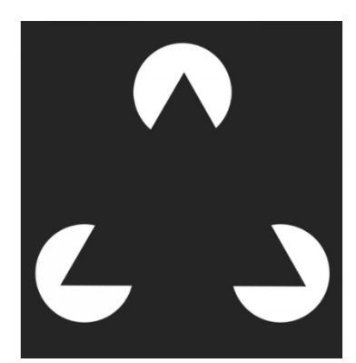

# Gestalt Laws (Proximity, Similarity, Closure, Good Continuation, Common Fate,
Good Form, Experience), leggi di Gestalt (esame)  
  
ProSiC GC ComF GFEx

Cosa vedi in questa immagine?  
  
Se sei come la maggior parte delle persone, probabilmente vedrai  
un triangolo. Ma in realtà, tutto quello che c'è sono tre "pac men"  
bianchi. Vediamo il triangolo perché il nostro cervello prende le  
informazioni visive ambigue e le organizza in qualcosa che ha  
senso per noi, qualcosa di familiare, ordinato, simmetrico e che  
comprendiamo.  
Quando questo processo cognitivo entra in gioco, le nostre menti  
saltano dal comprendere tutti gli elementi come componenti  
individuali e non correlati al vedere l'intera forma nel suo insieme.  
E di conseguenza, percepiamo forme e oggetti che nessuno ha  
creato.  
  
Le Gestalt Law sono delle leggi basate sul concetto di figura (focus) e sfondo
della figura  
(background) e sono divise in 7 categorie:  
• **Proximity** : il principio di prossimità afferma che le cose che sono
vicine tra loro sembrano  
essere più correlate delle cose che sono distanziate tra loro.  
  
  
• **Similarity** : la percezione tende a vedere stimoli che si assomigliano
fisicamente come parte di uno stesso oggetto e stimoli che sono diversi come
parte di oggetti diversi. Ad esempio, GitHub utilizza il principio di
somiglianza in due modi nella seguente pagina. In primo luogo, lo consentire
per distinguere diverse sezioni. Puoi immediatamente dire che la sezione
grigia in alto ha uno scopo diverso rispetto alla sezione nera, anch'essa
separata e diversa dalla sezione blu.  
  
  
• **Closure** : Il principio di chiusura afferma che quando osserviamo una
complessa disposizione di elementi visivi, tendiamo a cercare un modello unico
e riconoscibile. In altre parole, quando vedi un'immagine che ha parti
mancanti, il tuo cervello riempirà gli spazi vuoti e creerà un'immagine
completa in modo da poter ancora riconoscere lo schema.  
  
  
• **Continuity** : quando c’è un’intersezione tra due o più oggetti si
percepisce un oggetto come singolo e interrotto. Nell'immagine sotto, ad
esempio, i punti rossi nella linea curva sembrano essere più correlati ai
punti neri sulla linea curva che ai punti rossi sulla linea retta orizzontale.
Questo perché il tuo occhio segue naturalmente una linea o una curva, rendendo
la continuazione un segnale di relazione più forte rispetto alla somiglianza
del colore.  
  
  
• **Common fate** : afferma che gli elementi che si muovono insieme tendono ad
essere percepiti come un gruppo unificato. Pensa a guardare uno stormo di oche
che si muove attraverso un cielo autunnale. Le oche volano tutte nella stessa
direzione approssimativamente alla stessa velocità. Pertanto, li vediamo come
un gruppo gestalt, o in questo caso, un gregge.  
  
• **Good form:  **Il principio della figura-sfondo afferma che le persone
percepiscono istintivamente gli oggetti come in primo piano o sullo sfondo. O
spiccano in modo prominente nella parte anteriore (la figura) o si allontanano
nella parte posteriore (il terreno). Nell'immagine sotto, ad esempio, il tuo
occhio vede immediatamente una mela bianca su uno sfondo nero.  
  
  
• **Experience** : la mente tende a riconoscere modelli
significativi/familiari e quindi a riempire qualsiasi informazione mancante.
Nell’immagine sotto il nostro cervello riesce a farci riconoscere un cane (a
sinistra) ed il papa Giovanni Paolo II (a destra).  
Quando queste leggi sono in conflitto tra loro si hanno immagini impossibili o
ambigue.  
Una volta che abbiamo deciso quali informazioni devono essere presentate in
base al contesto dell'interazione, dobbiamo decidere come queste informazioni
possono essere presentate.  
La modalità visiva di per sé può supportare diverse modalità  
  
•**  statico**: testo, tabelle, immagini  
  
• **dinamico** : gesto

