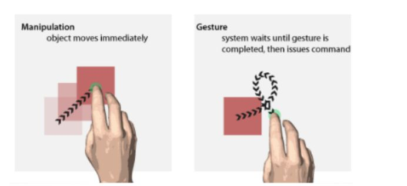

# Gesture Style (Deictic, Manipulation, Semaphoric, Sign Language, Gesture-
speech) (Esame)

  
  
Lo stile dei gesti si riferisce alle diverse modalità attraverso cui gli
utenti possono interagire con un sistema utilizzando gesti fisici o movimenti
del corpo. Questi stili possono includere:

  

  

  * **Deittico/Informativo/Manipolativo** : Questi gesti puntano a oggetti o posizioni specifiche nello spazio circostante, come indicare o puntare con il dito verso un oggetto (put that there, 1980)
  

  * **Manipolazione** : Questi gesti coinvolgono l'uso di movimenti fisici per manipolare oggetti o elementi nell'ambiente, come trascinare, ruotare o ridimensionare un'immagine su uno schermo touch.

  

  

  * **Semafòrico** : Questi gesti utilizzano segnali o simboli convenzionali per comunicare informazioni, come il segno di "OK" o "Stop"

  

  

  * **Linguaggio dei segni** : Questo stile coinvolge l'uso di gesti specifici e simboli manuali per comunicare concetti complessi, ed è utilizzato principalmente da persone non udenti.
  

  * **Gesto-parlato** : Questo stile combina gesti fisici con il parlato per migliorare la comunicazione e l'espressione, come l'uso delle mani durante una presentazione o una spiegazione.   
  
Ogni stile di gesto ha le proprie caratteristiche e applicazioni uniche, e la
scelta del miglior stile dipende spesso dal contesto e dalle preferenze
dell'utente. (es. il gesto ok, o il gesto della vittoria, cambia
l'interpretazione a seconda del paese)

  

  * **Non-perceptual Input"** : oggetti fisici che sono utilizzati per fare l'input. (es. il mouse o i touch screen).
  

  * **Wearable** : un insieme di sensori che tracciano qualcosa (es. accelerometro, giroscopio…), o guanti speciali
  

