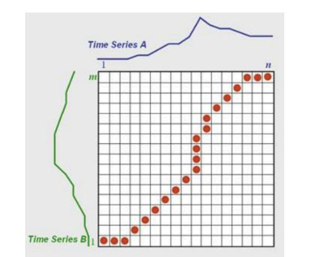

# LVR e approcci al riconoscimento vocale

Il**  Large Vocabulary Recognition (LVR)** si basa principalmente sui principi
del riconoscimento  
statistico dei modelli, ossia sul base model.  
  
Possiamo identificare approssimativamente **tre possibili approcci** al
riconoscimento vocale:  
• **Acoustic Phonetic approch** : esistono finite unità distinte (fonemi)
nella lingua in cui si sta parlando. I fonemi possono essere etichettati e
ampiamente caratterizzati da una seria di  
proprietà e combinati possono produrre unità aventi significato. Un fonema è
un'unitàmlinguistica dotata di valore distintivo, ossia una unità che può
produrre variazioni di significato se scambiata con un'altra unità: ad
esempio, la differenza di significato tra l'italiano “tetto” e “detto” è il
risultato dello scambio tra il fonema _  /t/ _e il fonema _/d/._  
Le proprietà acustiche di un fonema sono molto variabili e dipendono dallo
speaker e dai rumori ma sono semplici e possono essere calcolati con
semplicità dalla macchina.  
o 1. si fa **un’analisi spettrale** per convertire le misure delle onde in un
insieme di caratteristiche del fonema.  
o 2. bisogna **etichettare** tali caratteristiche.  
o 3. per determinare una parola valida dalla sequenza di etichette prodotte si
applicano dei vincoli linguistici sul segnale per esempio: il vocabolario e la
sintassi e altre regole semantiche.  
  
• **Pattern Recognition approch** : È composto da 2 step: **uno di training ed
uno di comparazione**. Nella fase di comparazione del metodo viene effettuato
un **match diretto** tra il suono sconosciuto (quello da riconoscere) con ogni
possibile pattern appreso durante la fase di training per permettere di
identificare la parola. Viene salvato in memoria un insieme di prototipi di
discorsi che rappresentano il dizionario delle parole ed il riconoscimento
avviene associando ciò che bisogna riconoscere con uno di questi prototipi,
selezionando il migliore. Uno degli approcci più popolari di oggi si basa sul
modello **Hidden Markov**. Quest’ultimo è caratterizzato da una serie di stati
finiti il cui cambiamento dipende soltanto dallo stato in cui ci si trova. Nel
riconoscimento vocale, le parole pronunciate da una persona non sono note, ma
vengono determinate in base a quanto strettamente corrispondono a un modello
delle misurazioni di come dovrebbero suonare. Gli HMM possono essere
utilizzati per costruire un modello di questo tipo per fornire la probabilità
di una sequenza di stati, che comprendono vettori di caratteristiche
(acustiche).  
•**  Pattern recognition DTW approch**: Dynamic Time Warping è un algoritmo
per misurare la somiglianza tra due sequenze che possono variare nel tempo o
nella velocità ed è applicato ad audio, video e grafica. Ad esempio,
verrebbero rilevate somiglianze nei modelli di deambulazione, anche se in un
video la persona camminava lentamente e se in un altro camminava più
velocemente, o anche se ci fossero accelerazioni e decelerazioni nel corso di
un'osservazione.  
Le due sequenze A e B da abbinare sono disposte ai lati di una griglia.  
Entrambe le sequenze iniziano in basso a sinistra della griglia. All'interno
di ogni cella può essere posta una misura di distanza, confrontando gli
elementi corrispondenti delle due sequenze. La migliore corrispondenza o
allineamento tra queste due sequenze è data da un percorso attraverso la
griglia, che riduce al minimo la distanza totale tra A e B.  
  
• **Artificial Intelligence approch:  **Quest’ultimo approccio è un ibrido tra
i 2 approcci precedenti. Si tenta di meccanizzare la procedura di
riconoscimento come quella che farebbe il cervello umano nel riconoscere i
suoni, le parole sono caratterizzate in base ad una serie di misurazioni
acustiche. Si usano tecniche di machine learning come le Neural Network, SVM,
linear classification, ecc.

