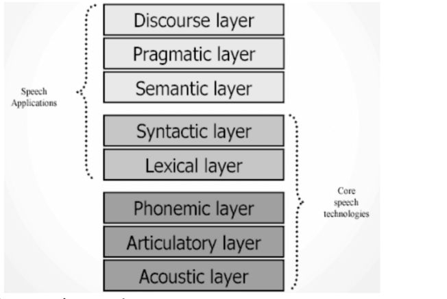

# Speech Recognition/Livello di comunicazione verbale (esame)

Abbiamo in totale 8 livelli di comunicazione vocale suddivisi in 3 strati:  
  
• Suono (livello acustico)  
• Produzione del linguaggio (livello articolato)  
• Singoli suoni (livello fonetico)  
• Parole (lessicale)  
• Come le parole possono essere combiante (livello sintattico)  
• Significato indipendente della parola (livello semantico)  
• In un contesto (livello pragmatico)  
• Come espressioni combinate per formare un discorso (livello di discorso)

