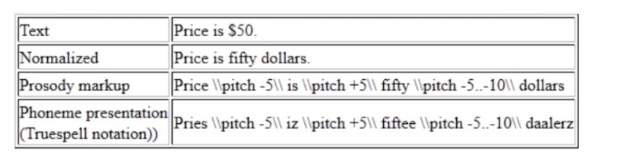

# Speech Syntesis process

1\. Pre-elaborare il testo dato in un elenco di fonemi e informazioni di
controllo della prosodia, suddiviso in fasi.  
2\. Acronimi, caratteri speciali, numeri, indirizzi e-mail e www, ecc. vengono
normalizzati in testo normale.  
3\. Vengono aggiunte informazioni prosodiche. La prosodia include volume,
velocità, variazioni di tono e pause. Se il discorso non ha prosodia, suona
molto monotono ed è difficile da capire.  
4\. Convertire il testo scritto composto da grafemi (caratteri) in fonemi:  
  
5\. Il passaggio finale della sintesi vocale è la generazione della forma
d'onda effettiva.  
  
Esistono tre approcci principali:  
a. **Sintesi concatenativa** : La sintesi concatenativa, come dice il nome, si
basa sulla concatenazione ossia la combinazione di frammenti di voce
registrati.  
Si tenta di combinare porzioni di segnale di parlato umano in maniera da
produrre un effetto quanto più naturale.  
  
b.**  Sintesi formante:**  formante: una qualsiasi delle numerose bande di
risonanza tenute per determinare la qualità fonetica di una vocale. La sintesi
formante utilizza una serie di regole fonologiche per controllare la
generazione del segnale audio.  
c. **Sintesi articolatoria** : cerca di modellare la produzione del linguaggio
umano a un livello molto più concreto rispetto alla sintesi formantica.
Modella il tratto vocale umano in 3D completo e simula il suo funzionamento.
Tali modelli sono molto complessi da calcolare, anche quando semplificati. La
sintesi articolatoria genera il parlato controllando gli articolatori del
linguaggio (ad esempio, mascella, lingua, labbra, ecc.). Cambiando la
posizione degli articolatori si modifica la forma del tratto vocale.

